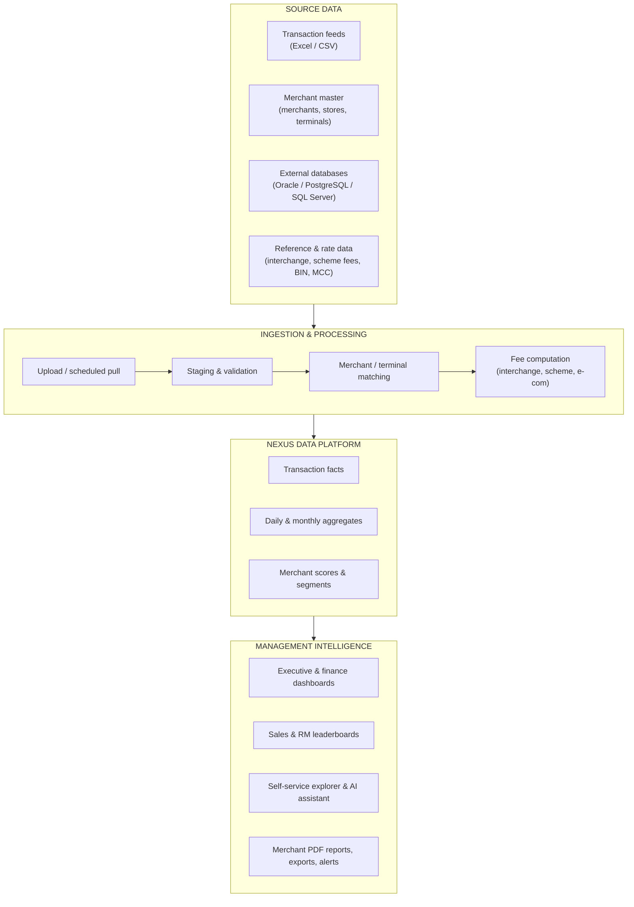
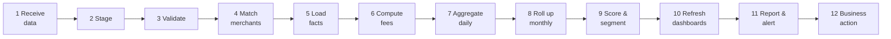
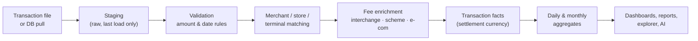
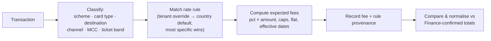
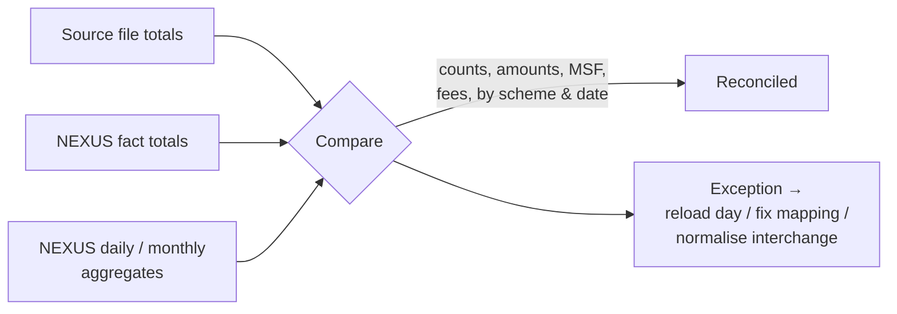
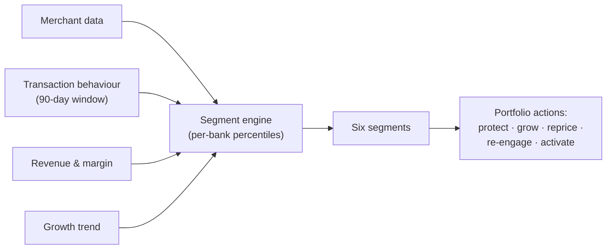
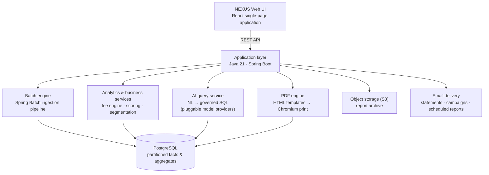
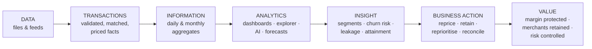

# NEXUS
## Merchant Acquiring Intelligence & Analytics Platform
### End-to-End Business and Functional Overview

**From Transaction Data to Merchant Intelligence and Business Action**

*Prepared for the Acquiring Steering Committee — August 2026*

---

# 1. Executive Summary

NEXUS is a multi-tenant merchant acquiring intelligence platform. It takes the raw material an acquiring bank already produces every day — transaction files, merchant master records, fee and settlement data — and converts it into a single, consistent view of acquiring performance: volumes, Merchant Service Fee revenue, interchange and scheme costs, net margin, merchant behaviour, sales performance and portfolio risk.

The platform exists because acquiring data is voluminous but rarely usable. A bank's switch and settlement systems record every transaction faithfully, yet answering ordinary management questions — *Which merchants are losing us money? Which relationship manager's portfolio is declining? What did interchange actually cost us last month, by scheme and card product?* — typically requires days of manual extraction and spreadsheet work. NEXUS answers these questions on screen, from data that reconciles back to source.

One NEXUS deployment serves multiple banks or acquiring entities. Each institution (tenant) is isolated by design: its own data, its own currency and decimal conventions, its own users, menus and branding. The platform is live-tested across multiple markets, with country rate cards and currency handling in place for the UAE, Bahrain, Oman and Egypt — including three-decimal currencies such as the Bahraini Dinar and local schemes such as BENEFIT and Meeza alongside Visa, Mastercard and JCB.

Its users span the acquiring organisation. Executives open a landing dashboard of volume, net margin and fee composition. Finance works with profitability, loss-making merchant and revenue-leakage views. Sales management runs leaderboards and target attainment for a Country Lead → Team Lead → Agent hierarchy. Operations monitors file loads and batch jobs. Analysts build their own queries in a governed self-service explorer, or simply ask questions in plain English through the built-in AI assistant. Merchants themselves receive monthly branded PDF insight reports generated in bulk by the platform.

> **Positioning statement.** NEXUS is an acquiring intelligence platform that ingests merchant, transaction and fee data, computes the full fee economics of every transaction — MSF, interchange, scheme fees and e-commerce fees — and presents acquiring performance, profitability, merchant behaviour and sales effectiveness in one governed, multi-bank analytical layer.

A reader should take away one central idea: NEXUS is not a payments switch, a billing engine or a CRM. It sits *after* processing and *before* decisions — the layer where transaction data becomes management information.

---

# 2. Business Problem and Purpose

Merchant acquiring is a thin-margin, high-volume business. Revenue is earned in basis points on every transaction; costs (interchange, scheme fees, processing) are also incurred in basis points on every transaction. Small pricing errors, unnoticed merchant attrition or unmanaged cost drift compound quietly across millions of transactions. The problems NEXUS addresses are familiar to any acquiring team:

* Transaction, merchant and fee data live in separate operational systems and arrive as large files, not as answers.
* Merchant-level profitability is invisible: MSF revenue is known in total, but interchange and scheme cost are rarely attributed back to the individual merchant.
* Management reporting is manual, slow and inconsistent — each team maintains its own spreadsheets with its own definitions.
* Dormant and declining merchants are discovered months late, when the revenue is already gone.
* Relationship managers have no systematic view of their own portfolios or targets.
* Repricing opportunities and revenue leakage (rate drift, zero-MSF activity) go undetected.
* Multi-country operations multiply all of the above: different currencies, decimal conventions, schemes and interchange regimes.

### Without NEXUS vs with NEXUS

| Question | Without NEXUS | With NEXUS |
| --- | --- | --- |
| What was portfolio volume and margin this month? | Assembled manually from files, days after month-end | On the executive dashboard, refreshed with each data load |
| Which merchants are loss-making? | Effectively unanswerable at scale | A standing report: merchants where MSF minus interchange, scheme and e-com fees is negative |
| Which merchants are about to go dormant? | Noticed after the fact | Attrition and churn-risk screens flag declining merchants while they are still recoverable |
| How is each sales agent performing against target? | Quarterly spreadsheet exercise | Live leaderboards and portfolio views across country, team and agent |
| What did interchange cost, and was it right? | A single ledger figure | Per-transaction computed interchange with rule provenance, plus a normalisation tool to align to the Finance-confirmed total |
| Can an analyst answer an ad-hoc question? | Request to IT, wait for an extract | Self-service explorer or a plain-English question to the AI assistant |

The purpose, in one sentence: give every function in the acquiring business — executive, finance, sales, operations, risk and product — the same trusted numbers, at merchant level, soon after the data arrives.

---

# 3. NEXUS at a Glance



Three characteristics define the architecture in business terms:

1. **Everything is computed once, at load time.** Fees, classifications and aggregates are calculated when data is ingested, so dashboards read pre-computed summaries and respond in seconds even over millions of transactions.
2. **One platform, many banks.** Every record carries a tenant identity; every screen, query, export and report is scoped to the institution the user is working in.
3. **Two currencies, one truth.** Each transaction is held both in cardholder currency (for reference) and in the bank's settlement currency; all revenue, cost and ranking figures use the settlement amount, so totals reconcile.

---

# 4. End-to-End Business Process

The complete lifecycle from source file to business action runs through twelve stages. The batch engine executes them as a single orchestrated job for every data load.



| Stage | Business purpose | Input | Processing | Output | Business value |
| --- | --- | --- | --- | --- | --- |
| 1. Receive data | Get source data into the platform | Transaction and merchant files; scheduled database pulls | File type auto-detected; owning bank identified from the file itself; cross-tenant uploads blocked | An accepted load request | Controlled, auditable intake |
| 2. Stage | Land raw rows untouched | Accepted file | Bulk load into staging, split across parallel workers | Raw staging rows | Fast, restartable loading |
| 3. Validate | Stop bad data early | Staging rows | Amount conventions applied per feed format; currency divisors applied per country; a hard gate rejects any load where no usable transaction date exists | Clean staging rows, or a rejected load with a clear reason | No silently empty or wrong loads |
| 4. Match merchants | Tie every transaction to a merchant, store and terminal | Staging rows + merchant master | Matching by store and terminal identifiers; placeholders auto-created when a transaction arrives before its merchant record, self-healing on the next master load | Fully attributed transactions | Merchant-level analysis becomes possible |
| 5. Load facts | Build the single source of truth | Matched rows | Existing rows for the same dates are replaced, then fresh rows inserted — re-loading a day is safe and repeatable | The transaction fact store | Idempotent, correctable history |
| 6. Compute fees | Attach the economics | Fact rows + rate cards | Interchange, scheme fee and e-com fee computed per transaction from country/tenant rate rules, with caps, flat components and effective dates; each row records *which rule* priced it | Priced transactions with fee provenance | Cost attribution and auditability |
| 7. Aggregate daily | Make analysis fast | Priced facts | Thirteen parallel daily summaries: by bank, merchant, terminal, scheme, channel, MCC, destination and more | Daily aggregate tables | Second-level dashboard response |
| 8. Roll up monthly | Serve long horizons | Daily aggregates | Monthly rollups that reconcile exactly to the daily figures | Monthly aggregate tables | Fast year-scale reporting |
| 9. Score & segment | Turn measures into judgement | Aggregates + history | Activity summaries, opportunity scores, churn-risk scoring, six-segment classification, revenue-leakage checks | Merchant scores, segments and flags | Prioritised portfolio actions |
| 10. Refresh dashboards | Deliver the numbers | All of the above | Caches evicted; KPI snapshots computed | Up-to-date screens | Everyone sees the same current figures |
| 11. Report & alert | Push, not just pull | Aggregates | Scheduled reports, threshold alerts, monthly merchant PDF packs, statement emails | Delivered outputs | Insight reaches people who never log in |
| 12. Business action | The point of it all | Dashboards, reports, alerts | Repricing, RM engagement, investigation, reconciliation sign-off | Decisions and follow-up | Revenue protected, cost controlled |

A typical daily transaction file of tens of megabytes completes the full pipeline in one to two minutes; historical migrations run at roughly a million rows per minute.

---

# 5. Data Ingestion and Processing

Data enters NEXUS through four routes, all converging on the same pipeline:

* **Browser upload** — an administrator drags a merchant master or transaction file (Excel or CSV) onto the upload screen and watches live step-by-step progress.
* **Server folder processing** — for bulk loads, files already on the server are processed in a controlled order: all merchant files first, then all transaction files.
* **Scheduled database pull** — the Integration Hub connects read-only to external Oracle, PostgreSQL or SQL Server sources and pulls data on a cron schedule, with run history and retry.
* **Bulk migration and backfill** — one-off tools for loading years of legacy history, month by month, with dry-run previews.

Two feed conventions are supported: one where amounts arrive as final decimals and one where they arrive in minor units and must be divided using each country's decimal convention (100 for most currencies, 1,000 for three-decimal currencies such as BHD and OMR). The file's owning institution is read from the file itself and verified against the uploader's permissions — a bank administrator cannot load data into another bank's tenant.

### Raw/staging data vs processed business data

Staging is a scratch area: it holds only the most recent upload, exactly as it arrived, and is cleared on the next load. It exists so that validation and matching can happen without touching trusted data. Processed business data — the transaction fact store and its aggregates — is the permanent, priced, merchant-attributed record that every dashboard and report reads.



Error handling is designed to fail loudly rather than quietly. A load whose rows all lack a usable payment date is rejected outright instead of appearing to succeed with zero rows. Row counts are asserted between staging and facts. Refunds are recognised and treated with their own fee rules. Re-loading a day replaces that day cleanly. When a correction is needed, operations can delete a single tenant-day and rebuild the affected summaries, or re-run the interchange normalisation described in section 9.

---

# 6. Merchant and Terminal Intelligence

NEXUS models the acquiring portfolio as a hierarchy: **Merchant → Store → Terminal**. The merchant master feed populates this hierarchy along with the attributes analysis depends on: legal and trading names, merchant category (MCC), assigned relationship manager or sales agent, referral partner, onboarding information and settlement configuration.

On top of the hierarchy, NEXUS maintains a **Merchant 360** view: a single page bringing together a merchant's KPIs, transaction history, settlement summary, stores and terminals, contacts, documents, risk profile and activity timeline. From any dashboard figure, a user can drill to the merchant behind it and see the whole relationship.

The platform also derives what the master file cannot say — behaviour:

* **Activity status** — active, new, dormant or zero-transaction, based on actual transacting behaviour rather than onboarding paperwork. "New" is defined by first revenue, not by a record-creation date.
* **Trend and stability** — monthly metrics per merchant including volatility, weekday patterns and health indicators.
* **Opportunity score** — a 0–100 growth/upsell score with reason tags, recalculated on every load.
* **Churn risk** — a predictive score estimating the likelihood of the merchant going dormant in the next 30–60 days (section 14).
* **Segment** — one of six data-driven portfolio segments (section 12).

This is the essential move NEXUS makes: from *rows of transactions* to *a managed portfolio of merchant relationships*, each with a measurable value, direction and risk.

Complementary screens include the merchant growth heatmap (merchant × month), side-by-side merchant comparison (2–10 merchants across KPIs, trends and scheme mix), the zero-transaction report (never transacted / inactive 7–30 days / inactive 30+ days) and assignment history whenever a merchant moves between sales agents.

---

# 7. Transaction Analytics

Every transaction fact carries the dimensions the business analyses by: date, merchant, store, terminal, card scheme (Visa, Mastercard, JCB, UPI, BENEFIT, Meeza and others), card type (credit / debit / prepaid), card product tier, destination (domestic or international), channel (POS or e-commerce), transaction type (purchase or refund), DCC opt-in flag, MCC, ticket-size band, and amounts in both cardholder and settlement currency together with MSF, interchange, scheme fee and e-com fee.

These dimensions support drill-down from the whole book to a single ticket:

```text
Bank → Portfolio → Relationship Manager → Merchant → Store → Terminal → Transaction
```

Three analytical surfaces serve different depths of question:

* **Curated dashboards** (sections 11 and 13) answer the standing questions — performance, attrition, profitability, sales — with fixed, agreed definitions.
* **The Analytics Explorer** is governed self-service. Users drag dimensions and measures, build calculated measures (with safe, whitelisted functions), apply Qlik-style associative filtering (selections in one field immediately show what is possible or excluded elsewhere), assemble multi-widget dashboard sheets, save and share views, promote definitions to governed "master items", and set threshold alerts that the server evaluates on schedule. The engine automatically answers from pre-aggregated summaries when it can and falls back to transaction-level data only when the question requires it.
* **The AI assistant** accepts plain-English questions ("top ten merchants by volume last month", "monthly trend of international e-commerce volume") and translates them into safe, read-only, tenant-scoped queries against the warehouse, returning a table, an automatic chart and the generated query for transparency. Relative dates are anchored to the latest loaded data, not the wall clock, so "this month" means the month the data actually covers.

Interactive cross-filtering ties visual exploration together: clicking a bar in one chart re-filters every other widget and the timeline, with removable filter chips.

---

# 8. Revenue, MSF and Merchant Profitability

**Merchant Service Fee (MSF)** is the acquiring business's revenue line: the fee charged to the merchant on each transaction. In NEXUS, MSF arrives from the source feed as part of each transaction record — the platform reports and analyses it; it does not invoice it.

**Acquiring costs** are computed by NEXUS itself, per transaction, at load time (section 9): interchange paid to the card issuer, scheme fees paid to the card network, and e-commerce gateway flat fees where applicable.

**Merchant profitability** follows directly, exactly as implemented in the platform:

```text
Net revenue (margin) = MSF − Interchange − Scheme fee − E-commerce fee
```

Margin percentage is expressed over settled volume, and effective rates are shown in basis points so that pricing conversations use the industry's natural units.

This one formula, applied at transaction level and aggregated to every grain, powers a family of standing views:

* **CEO Volume & Revenue** — a merchant-level profit and loss table: count, volume, MSF, interchange, scheme fee, e-com fee, net margin and margin %.
* **Loss-making merchants** — the same view restricted to merchants whose total margin is negative: the repricing shortlist.
* **High-volume / low-margin** — merchants above a volume threshold and below a margin threshold: the highest-value pricing conversations.
* **Finance dashboard revenue bridge** — MSF revenue walked down through each cost component to net margin, with a clickable profitability explorer by merchant, MCC, scheme or channel.
* **Revenue KPIs** — effective MSF rate (bps), net take rate (bps), average ticket, and DCC opt-in/penetration measures including missed-DCC volume.
* **What-if pricing simulator** — pick a cohort (by MCC, scheme, RM, partner or individual merchant), move the MSF rate or mix assumptions, and see the projected margin effect before any repricing decision. It is a modelling tool, deliberately separate from actual rate maintenance.
* **Revenue leakage detection** — automated checks comparing each merchant's recent week against its own baseline, flagging volume drops, MSF-rate drops, zero-MSF activity and dormancy-driven revenue loss, with a triage workflow (resolve / ignore / reopen) and estimated monthly impact.

Together these views answer the questions a margin business lives on: who makes us money, who costs us money, where is pricing drifting, and what is it worth to fix.

---

# 9. Interchange and Fee Normalisation

Interchange is usually the largest single cost in acquiring, and the hardest to see clearly. NEXUS makes it explicit at transaction level.

### How NEXUS prices a transaction

At load time, each transaction is classified — scheme, card type, product tier, domestic or international destination, POS or e-commerce channel, merchant category — and matched against a rate-card hierarchy: tenant-specific rules override country defaults, and more specific rules (for example, scheme + MCC) take priority over general ones. Rules support percentage rates, caps, flat components and effective dating. Refunds carry their own treatment (interchange and scheme fee are not charged on refunds). Rate cards are seeded per market — UAE, Bahrain, Oman and Egypt — including local schemes.

A worked example from live verification: a BHD 100.000 domestic Visa POS transaction at a supermarket prices at 1.75% interchange (1.7500 BHD) plus 0.11% scheme fee, a total of 1.8600 BHD; a BENEFIT petrol transaction hits its interchange cap and is charged the capped amount rather than the percentage.

Critically, every priced transaction records **provenance**: which rule priced it and with what resolution status (fully resolved, resolved via a wildcard, priced with a placeholder rate, or unpriced because a mapping was missing). Unpriced or placeholder rows are visible per load, so gaps in reference data surface as a work queue instead of a silent error.



### Interchange normalisation

Computed interchange and the scheme-billed reality can drift — rates change mid-month, adjustments arrive late. NEXUS includes a controlled correction tool: Finance supplies the confirmed interchange total for a month; the platform previews how the difference would be allocated across transactions in proportion to volume (using a largest-remainder method so the allocation sums exactly, and never driving any merchant's interchange negative); on approval it applies the correction and rebuilds every affected summary. Each run is versioned, with full detail history and the pre-correction values retained. The tool refuses to apply a run that does not reconcile.

For the business, this closes the loop between analytical interchange and accounting interchange: merchant margins are computed on numbers Finance has confirmed, which is what makes the loss-making and repricing lists credible enough to act on.

*In progress:* BIN-based card typing. NEXUS already holds an extensive BIN reference (including full scheme BIN ranges) and an upload facility for it, but transaction classification currently uses the card-type information in the feed; deriving card type and issuer country from BIN is designed and planned, not yet active.

---

# 10. Reconciliation and Data Integrity

An analytics platform is only as useful as its numbers are trusted. NEXUS builds reconciliation into the pipeline rather than treating it as an afterthought:

* **Load-time assertions** — row counts are checked between staging and the fact store; a load with no usable dates is rejected, not accepted empty.
* **Grain reconciliation** — daily aggregates are built from the same fact rows they summarise, and monthly rollups are exact sums of daily rows; live verification confirmed fact-level totals equal to dashboard totals to the last decimal across tenants.
* **Currency precision end-to-end** — amounts are carried at full precision from file to fact to API to screen to export, respecting each currency's decimals (three for BHD, two for EGP), so an exported figure matches the on-screen figure and both match source.
* **Fee resolution reporting** — every load reports how many transactions were priced fully, priced by wildcard, priced with placeholders or left unpriced, making reference-data gaps measurable.
* **Refund treatment** — refunds are signed correctly in volumes and excluded from interchange/scheme costs by rule.
* **Correction paths** — re-uploading a day replaces it cleanly; a single tenant-day can be deleted and summaries rebuilt; interchange normalisation aligns computed cost to Finance's confirmed totals.



For Finance this means month-end packs stand on reconciled data; for Operations it means a bad file is caught the day it arrives; for management it means one set of numbers across every screen.

---

# 11. Executive and Management Dashboards

NEXUS ships a substantial set of purpose-built screens, organised in the navigation by audience: Executive, Business Analytics, Sales, Finance, Merchant Management, Operations and Administration. Each user sees only the menus their access group grants — the same grants are enforced on the server, not just hidden in the interface.

**Executive layer.** The landing dashboard gives month-to-date and year-to-date volume, net margin, margin % and transaction counts with sparklines, plus a secondary rail of effective MSF rate and each fee component as a share of volume, and MSF composition charts — with CSV export of whatever range is on screen. The Executive Sales Pulse reads the whole sales organisation in realised-margin terms.

**Business analytics layer.** The business dashboard covers volume, transactions, merchant counts (active, new, dormant, zero-sales), average ticket, effective MSF rate, net take rate and a full set of DCC measures, each with period-over-period deltas. Around it sit the attrition report (merchants classified churned / declining / stable / performing, with value-at-risk), the retention report (churn rate, revenue-weighted churn, reactivation and win-back), the zero-transaction report, the growth heatmap, the daily merchant dashboard, top performers (including top-10 concentration), group reports (roll-ups by MCC, merchant, sales user or referral partner), merchant comparison, opportunity intelligence and the destination dashboard — the domestic versus international view, splitting volume and share by scheme, card type, channel and MCC, alongside DCC opt-in.

**Finance layer.** The finance dashboard (revenue bridge, profitability explorer, risk watchlist), finance summary with month-to-day drill-down, and the loss-making / high-volume-low-margin lists (section 8).

**Merchant layer.** Merchant Universe (list, Merchant 360, stores, terminals, operations), merchant hierarchy, transaction browser with export, merchant summary, insight hub and transaction trends drill (year → month → day).

A note on KPI hygiene: every figure on these screens traces to the same aggregate tables built at load time, and rankings deliberately use settlement-currency amounts so that a "top merchant" is top in money the bank actually settles, not in mixed cardholder currencies.

| Module | Purpose | Primary users | Business outcome |
| --- | --- | --- | --- |
| Executive dashboard | Portfolio health at a glance | C-level | Direction and early warning |
| Business dashboard & attrition/retention | Merchant base dynamics | Head of Acquiring, business teams | Retention actions before revenue is lost |
| Finance dashboard & profitability lists | Margin and cost control | Finance | Repricing and cost decisions |
| Destination dashboard | Domestic vs international mix, DCC | Product, business | Cross-border and DCC strategy |
| Sales leaderboards & portfolios | Sales performance | Sales head, RMs | Target management, coaching |
| Analytics Explorer & AI assistant | Ad-hoc questions | Analysts, all teams | Answers without IT queues |
| Report manager & PDF packs | Outbound reporting | Operations, RMs | Merchant communication at scale |

---

# 12. Merchant Segmentation

NEXUS classifies every merchant into one of six segments over a trailing 90-day window, using thresholds computed from each bank's own portfolio (percentiles, not fixed numbers — so "high volume" means high *for that bank*):

| Segment | Meaning | Typical action |
| --- | --- | --- |
| At Risk | Meaningful decline or dormancy signals | RM engagement now, before churn |
| Strategic | High volume *and* high margin | Protect: service quality, senior attention |
| Volume Driver | High volume, thinner margin | Repricing or cost review candidates |
| Profit Driver | Strong margin on moderate volume | Grow: cross-sell, limits, terminals |
| New | Recently started transacting | Activation monitoring, early support |
| Long Tail | Small, stable remainder | Efficient, low-touch management |

Segments are assigned in priority order (risk first), carry secondary tags, and are recalculated automatically as part of every data load — so the segmentation is always a reflection of current behaviour, not of a one-off study.



Segmentation is what turns thousands of merchant rows into a handful of portfolio conversations with clear owners.

---

# 13. Sales and Relationship Manager Intelligence

NEXUS models the sales organisation as **Country Lead → Team Lead → Sales Agent**, with each merchant attributed to an agent. The suite includes:

* **Sales Executive Dashboard** — the whole organisation as a tree, every node carrying the same metrics (volume, margin, merchant counts), each parent the exact sum of its children, with change versus the prior equivalent period and drill-down to an individual agent's merchants.
* **Leaderboards** — agents, teams and countries ranked by net margin (the platform deliberately ranks on margin, not raw volume), with onboarding counts, average net rate, period choices anchored to the latest loaded data, and gamified badges (Million Club, Onboarding Star, #1 Team and others) to keep the ranking engaging.
* **Targets and attainment** — annual targets phased into twelve monthly figures (hand-adjustable for seasonality), with attainment shown across the sales screens and the forecasting view. Targets are optional; screens display a dash until they are set.
* **Portfolio views** — each RM's merchant list with trends, so account priorities come from data.
* **Hierarchy administration** — team and country-lead management, agent directory, and a full audit history of merchant reassignments between agents.

A practical scenario: an RM opens their portfolio and sees a merchant flagged "declining" in the attrition view, with volume down sharply versus the prior period and a raised churn-risk score. The RM reviews the merchant's transaction history and margin in Merchant 360, calls the merchant, discovers a terminal issue at their busiest store, and resolves it — weeks before the merchant would have appeared in a quarterly report as churned.

---

# 14. Risk and Behavioural Monitoring

NEXUS approaches risk as *behavioural visibility* — surfacing patterns that merit human investigation:

* **Churn-risk scoring** — a machine-learning model (a random forest trained separately on each bank's own history, retrained weekly) estimates each merchant's probability of going dormant within 30–60 days, with a risk band and the main contributing reason. The model reads behavioural features such as volume trend, volatility, recency and average-ticket drift. Where a bank's history is too thin to train on, the platform degrades gracefully to simpler statistical scoring, and each score records which method produced it.
* **Revenue-leakage flags** — volume drops, MSF-rate drops, zero-MSF activity and dormancy losses against each merchant's own baseline, with severity and a triage workflow.
* **Merchant risk profile** — a per-merchant risk record (risk score, compliance/KYC status) within Merchant 360.
* **Threshold alerts** — user-defined rules on any governed measure ("alert me if daily international volume for this segment exceeds X"), evaluated server-side on schedule, with alert history.
* **Behavioural analytics** — refund patterns, domestic/international mix, channel mix and ticket-size distributions are all first-class dimensions, so unusual shifts are visible in the standard screens.

These indicators assist investigation and prioritisation; they do not, by themselves, imply fraudulent activity, and NEXUS does not take automated action against merchants.

---

# 15. Forecasting and Benchmarking

The forecasting module projects the current month's end position for volume, transactions, MSF revenue and net margin. Its method is deliberately transparent rather than a black box: a blend of the month's actual run rate (with day-of-week awareness) and the prior year's intra-month seasonal profile, with the weighting shifting toward actuals as the month progresses. The design goal, stated in the platform itself, is that *every number is explainable*.

Projections are compared to targets and expressed as a plain status: On Track, Likely to Exceed, At Risk, Behind, Critical — or No Target where none is set. Benchmarking views compare performance across peers, relationship managers and prior periods.

The four questions, and where NEXUS answers them:

* **What happened?** — dashboards and reports over daily/monthly aggregates.
* **Why did it happen?** — drill-downs, cross-filtering, explorer, group reports.
* **What is likely to happen?** — month-end projections and churn-risk scores.
* **What should we act on?** — segments, leakage flags, attrition lists, target-risk statuses and alerts.

(The churn *prediction* used in attrition views is the machine-learning score of section 14; the month-end *projection* is the explainable run-rate method. The two are intentionally different tools for different questions.)

---

# 16. Business Reporting

Beyond the screens, NEXUS produces and distributes reporting:

* **CSV exports** throughout — dashboards, profitability tables, transaction lists (with card numbers masked), user and audit lists; exports honour each tenant's currency precision.
* **Server-side CSV/Excel export** from the Analytics Explorer, plus a **report builder** with saved templates and **cron-scheduled reports** delivered by email.
* **Merchant Monthly Insight PDF reports** — a branded, multi-section pack per merchant (executive summary, scorecard, month-on-month comparison, sales trends, peak analysis, store leaderboard, card analytics, customer intelligence, DCC page, glossary and more), generated in bulk for the whole portfolio or a chosen list, and delivered as local files, S3 archive, ZIP download or emailed directly to each merchant with a templated covering email.
* **Statement and campaign emails** — template management with merge variables, campaign launch, retry of failures and per-recipient delivery logs.
* **External API** — a scoped, key-authenticated read API through which other bank systems can pull merchant, transaction and analytics data, plus programmatic report access.

| Audience | Typical requirement |
| --- | --- |
| Executive management | Portfolio KPIs, month-end position, concentration |
| Finance | Profitability, reconciliation, fee analysis, exports |
| Acquiring business | Merchant, scheme and channel performance |
| Sales | Leaderboards, targets, portfolio detail |
| Risk | Behavioural flags, churn risk, watchlists |
| Operations | Load status, batch logs, data-quality outcomes |
| Merchants | Monthly PDF insight report |

---

# 17. User Journeys

### Executive
```text
Login → Executive dashboard → MTD margin below trend
→ Switch to attrition report → See value-at-risk concentrated in two segments
→ Drill to steepest-declining merchants → Assign follow-up to sales head
```

### Relationship Manager
```text
Login → Sales portfolio → Sort merchants by decline
→ Open Merchant 360 for the worst → Volume down, margin intact, one store gone quiet
→ Contact merchant → Log outcome; watch reactivation in retention report
```

### Finance
```text
Month-end → Load period data → Check fee-resolution report (all priced?)
→ Compare NEXUS interchange to scheme billing → Run interchange normalisation preview
→ Apply confirmed total → Export profitability and loss-making lists for review
```

### Acquiring product team
```text
Destination dashboard → International share rising on e-commerce
→ Group report by scheme and MCC → Margin thinner on one corridor
→ Pricing simulator on the affected cohort → Model MSF adjustment → Repricing proposal
```

### Operations
```text
Morning files arrive → Server-file processing (merchants, then transactions)
→ Batch monitor: all steps green, row counts match
→ One load flags unmapped channels → Fix mapping → Re-run day → Dashboards refresh
```

### Analyst
```text
Ad-hoc board question → AI assistant: "monthly volume by scheme this year"
→ Refine in Analytics Explorer → Add calculated margin measure
→ Save view, share it, schedule the export monthly
```

---

# 18. Roles and Business Responsibilities

Access in NEXUS is organised around groups whose menu grants determine exactly which screens each person sees — and the server enforces the same grants on the underlying data services.

| Business role | Main NEXUS usage |
| --- | --- |
| CEO / Executive | Landing dashboard, sales pulse, top performers, forecasts |
| Head of Acquiring | Business dashboard, attrition/retention, segments, destination mix |
| Finance | Finance dashboard, profitability, normalisation, reconciliation, exports |
| Sales Head | Executive sales dashboard, leaderboards, targets, team management |
| Relationship Manager | Portfolio views, merchant 360, attrition and churn-risk lists |
| Product | Scheme/channel/destination analysis, pricing simulator, DCC KPIs |
| Risk | Leakage flags, churn scores, risk profiles, alerts |
| Operations | Uploads, server-file processing, batch monitoring, statement emails |
| Bank Administrator | Users, groups and menus, tenant settings, report manager |
| Platform Administrator | Tenants, provisioning, migrations, BIN reference, normalisation, backups |

---

# 19. High-Level Technical Architecture

For technology stakeholders, the platform is a deliberately compact, modern stack:



In business-friendly terms: a web application (React) talks to a single Java/Spring service that contains the batch ingestion engine, the fee and analytics logic, the AI query service and the PDF generator; everything persists in one PostgreSQL database, partitioned by date (and optionally by tenant) so that queries touch only the slices they need. Reports can be archived to S3 and delivered by email. The platform deploys on Linux behind nginx, with documented paths for both traditional servers and Kubernetes/AWS, and includes built-in database backup/restore and maintenance scheduling. The AI assistant supports multiple model providers — including locally hosted models, so natural-language querying can run without data leaving the bank's environment.

---

# 20. Data Architecture

The information lifecycle is a straightforward warehouse pattern, kept deliberately legible:

```text
Source feed
   ↓
Staging (raw, transient — last load only)
   ↓
Validated, merchant-matched transaction
   ↓
Fee enrichment (interchange · scheme · e-com, with rule provenance)
   ↓
Transaction fact store (date-partitioned, dual currency)
   ↓
Daily aggregates (by bank, merchant, terminal, scheme, channel, MCC, destination…)
   ↓
Monthly rollups (exact sums of daily)
   ↓
Derived intelligence (activity, opportunity, churn, segments, leakage)
   ↓
Dashboards · Explorer · AI · Reports · API
```

Two design rules matter to business users. First, **dashboards never scan raw transactions for totals** — they read pre-computed aggregates, which is why screens are fast and figures are consistent. Second, **monthly figures are exact sums of daily figures**, which is why a monthly report and a daily report can never disagree. Master data (merchants, stores, terminals), reference data (schemes, countries, MCC sectors, rate cards, BIN ranges) and security/administration data are held in their own table families; an appendix-level table inventory exists in the platform's technical documentation for those who need it.

---

# 21. Data Security and Tenant Separation

Because NEXUS serves multiple banks from one deployment, isolation and access control are foundational:

* **Authentication** — username/password with short-lived signed tokens and rotating refresh tokens (re-use of a stolen refresh token revokes all of a user's sessions). Microsoft Entra ID single sign-on is supported, with self-service access requests routed to administrators for approval. Password reset uses a one-time code emailed to the user, hashed at rest, expiring in minutes and attempt-limited.
* **Account controls** — configurable password policy (length, complexity, history, expiry), login lockout after repeated failures, login rate limiting, concurrent-session caps, session timeout, forced password change, and account expiry — administered per tenant in the security settings without redeployment.
* **Authorisation** — three platform roles (super administrator, bank administrator, user) combined with group-based menu grants; the grants drive both what appears in a user's navigation and what the server will actually serve. Sensitive finance views are restricted to finance-entitled groups.
* **Tenant separation** — every request carries the working tenant, which is validated against the user's explicit tenant permissions (a mismatch is refused outright); every business query is scoped to that tenant; and database row-level security policies are defined as an additional backstop, with the application-level scoping serving as the primary, verified enforcement. Independent end-to-end testing across tenants recorded zero data-leak findings. Tenant-wise physical partitioning is available for institutions requiring it.
* **Data protection** — card numbers are masked to the last four digits in transaction exports; stored credentials for email, storage and external database connections are encrypted; API keys are stored only as hashes, carry scopes, expiry, per-key rate limits and optional IP allowlists, and every external API call is logged.
* **Auditability** — a comprehensive audit log records who did what, when, from where, against which entity, with a searchable, exportable viewer scoped to each bank.

A candid distinction for auditors: the above describes NEXUS's *security design*, as implemented and tested. It is not a claim of formal certification (for example PCI DSS), which is an organisational assessment outside the platform's own scope. Multi-factor authentication appears in the security settings but its enforcement is not yet active.

---

# 22. Operational Processing

The operational rhythm of NEXUS is file-in, dashboards-out:

```text
File received (upload / server folder / scheduled pull)
      ↓
Batch job started — visible step-by-step progress
      ↓
Validation (or rejection with a stated reason)
      ↓
Facts loaded · fees computed · aggregates updated · scores refreshed
      ↓
Job completed — run recorded in batch logs
      ↓
Dashboards and caches refreshed
```

Operations staff have a dedicated toolkit: live progress with named steps during uploads; a batch monitoring screen with job and step history; a fee-resolution report per load showing anything left unpriced; integration run history with one-click retry for scheduled pulls; and correction tools — replace a day by re-uploading it, delete a single tenant-day with explicit confirmation, rebuild summaries, or run interchange normalisation. Database maintenance (nightly analyze/vacuum in a configured window, aware of running jobs) and backup/restore are built into the administration screens rather than left to ad-hoc scripts. Bulk operations are intentionally sequential — merchant files before transaction files — to keep loads deterministic and self-healing.

---

# 23. Business Benefits

**Revenue.** Merchant-level margin visibility for the first time; standing loss-making and high-volume/low-margin lists as a repricing pipeline; automated leakage flags catching rate drift and zero-MSF activity against each merchant's own baseline; DCC opportunity quantified.

**Merchant management.** A live portfolio view instead of a static ledger: activity status, six behavioural segments, opportunity scores and churn risk recalculated with every load; dormancy caught in the 7–30 day window rather than at quarter-end.

**Cost management.** Interchange and scheme cost computed per transaction with rule provenance; cost drivers visible by scheme, product, destination and channel; the normalisation tool keeping analytical cost aligned with Finance's confirmed totals.

**Sales.** A margin-ranked (not volume-ranked) view of every agent, team and country; targets phased monthly with live attainment; portfolio drill-downs that make coaching conversations specific.

**Operations.** One controlled ingestion path with validation gates instead of spreadsheet consolidation; repeatable month-end packs; correction tools that make errors recoverable rather than permanent.

**Management.** A single intelligence layer with one set of definitions across every function and market — including multi-currency portfolios — plus self-service and plain-English querying that shortens the distance between a question and its answer.

The platform avoids overstating itself; equally, the categories above are not aspirations — each maps to a shipped screen or engine described in this document.

---

# 24. Example End-to-End Business Scenario

**A mid-sized supermarket merchant's volume falls 25% in a month.**

1. The daily transaction files containing the merchant's (reduced) activity load through the standard pipeline; facts, fees and aggregates update within minutes of each file.
2. The nightly-refreshed merchant metrics register a sharpening negative trend; the churn model raises the merchant's risk score, citing volume trend and recency.
3. The attrition report moves the merchant into the "declining" cohort, and its MSF contribution appears in the report's value-at-risk figure. The segment engine re-tags the merchant "At Risk".
4. The responsible agent sees the merchant near the top of their portfolio's decliners; the sales lead sees the same picture one level up on the executive sales dashboard.
5. In Merchant 360, the RM notices the decline is confined to one store — the merchant's second location has gone silent while the first is stable. This is a terminal or store problem, not a lost relationship.
6. The RM contacts the merchant: the store's terminal failed and was never replaced. A replacement is arranged.
7. Over the following weeks, the retention report shows the merchant reactivating; the churn score decays; the segment returns to Volume Driver.

**A companion pricing scenario.** Finance's monthly review of the fee-resolution report shows a batch of e-commerce transactions priced by wildcard rules on a new international corridor. The product team examines the corridor in the destination dashboard and group reports, finds margins thinner than assumed, models an MSF adjustment for the affected cohort in the pricing simulator, and takes a quantified repricing proposal to committee — with the interchange side of the case standing on normalised, Finance-confirmed cost.

---

# 25. NEXUS Business Value Chain



Each link is a shipped capability: the pricing of facts (fee engine), the aggregation discipline (exact daily-to-monthly reconciliation), the analytical surfaces (dashboards, explorer, AI), the derived intelligence (segments, scores, flags) and the delivery mechanisms that push insight outward (alerts, scheduled reports, merchant PDFs).

---

# 26. Conclusion

Most acquiring organisations do not lack data; they lack a shared, trusted, merchant-level reading of it. The practical achievement of NEXUS is that Finance's margin figure, the sales leaderboard's ranking, the executive dashboard's headline and the merchant's own PDF report are all computed once, from the same priced transaction facts, under the same definitions — and reconcile to source.

That single property changes how the functions work together. Acquiring and Product argue about pricing from the same margin table Finance signed off. Sales conversations start from portfolio data both the RM and the sales head can see. Operations knows a load either passed its gates or was rejected with a reason. Risk and business teams triage the same flags. Management asks a question in plain English and gets an answer grounded in the warehouse, not in someone's spreadsheet.

For a multi-market acquirer, the same discipline extends across borders: new institutions are provisioned as tenants with their own currencies, schemes and rate cards, inheriting the entire analytical stack from day one. The platform's near-term roadmap — BIN-driven card classification, a unified settings hub, rate-card administration screens — builds on that foundation rather than changing it.

NEXUS is best understood, then, not as a reporting tool but as the acquiring business's common intelligence layer: the place where transaction data becomes the numbers the organisation runs on.

---

# Appendix — Business Glossary

| Term | Meaning |
| --- | --- |
| MID | Merchant Identifier — the unique ID of a merchant in the acquiring book |
| SID | Store Identifier — a merchant's individual outlet/location |
| TID | Terminal Identifier — an individual acceptance device or gateway endpoint |
| MSF | Merchant Service Fee — the fee charged to the merchant per transaction; the acquirer's revenue line |
| MCC | Merchant Category Code — the scheme-defined business-category code (e.g., 5411 supermarkets) |
| Interchange | The fee paid by the acquirer to the card issuer on each transaction; typically the largest acquiring cost |
| Scheme fee | Fees paid to the card network (Visa, Mastercard, etc.) for processing across the scheme |
| E-com fee | Per-transaction flat fee applied to e-commerce/gateway transactions in NEXUS's cost model |
| Net revenue / margin | MSF minus interchange, scheme fee and e-com fee |
| BIN | Bank Identification Number — the leading digits of a card number identifying issuer, scheme and product |
| DCC | Dynamic Currency Conversion — offering international cardholders payment in their home currency; a revenue opportunity for the acquirer |
| RM / Sales agent | Relationship Manager — the salesperson who owns the merchant relationship |
| POS | Point of Sale — card-present acceptance at a physical terminal |
| ECOM | E-commerce — card-not-present acceptance online |
| Domestic / International | Whether the card was issued in the merchant's home market or abroad; a primary pricing dimension |
| Refund | A payment returned to the cardholder; signed negatively and exempt from interchange/scheme cost in NEXUS |
| Tenant | One bank or acquiring institution within the shared NEXUS platform |
| Attrition / churn | Decline or cessation of a merchant's transacting activity |
| Basis points (bps) | Hundredths of a percent; the natural unit of acquiring pricing (1.75% = 175 bps) |
| Effective MSF rate | Total MSF divided by total volume, in bps — the realised average price of the portfolio |
| Average ticket | Average transaction value |

---

# Documentation Sources Reviewed

This document was prepared from the platform's own repository — its written documentation validated against the implemented application code:

```text
Product feature guide and developer guide (root and docs/)
Project instructions and architecture notes
Multi-country fee engine and interchange audit documentation
Tenant, security and API management audit documentation
End-to-end test plans and execution reports (multi-market)
Authentication/OTP security design documentation
Deployment guides (Linux and Kubernetes/AWS)
Database migration scripts and schema documentation
Batch ingestion job configuration and services
Analytics, finance, sales and dashboard service code
Frontend application screens and navigation configuration
PDF report engine and AI query service code
```

Functionality is described as currently available only where both documentation and implementation support it; capabilities that are designed but not yet active (notably BIN-based card typing, the unified settings hub and rate-card administration screens) are identified as such in the text.
